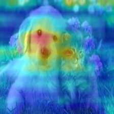

# LambdaResNet reproduction
link to [paper](https://arxiv.org/abs/2102.08602), [YouTube](https://www.youtube.com/watch?v=3qxJ2WD8p4w)
This project implements Lambda-Resnet and analyzes its performance on small datasets namely ImageNette, the subset of ImageNet. With the same training configurations, we compare the differences of both training and validation loss on this dataset, with different levels of noisy labels and model architecture.




Fullgrad of lambdaResNet50(pre-trained in ImageNet)(left) and ResNet50(pre-trained)(right) 
## Repo Structure
- `data` The imageNette data class and image augmentation transform.
- `figure` Some grad cam figures and their original image(from imageNette and gradCAM repo).
- `grad_cam` The grad CAM code(edit from grad CAM repo).
- `layers` Lambda layer and SE attention block.
- `model` The ResNet with lambda layer.
- `models` Our trained models.
- `reports` Our analysis paper.
- `KaggleTraining.ipynb` The original code we use for training our model.
- `train.py`
- `test.ipynb` Some tests during implementation.

## How to run
- kaggle or colab(recommand) \
Using `KaggleTraining.ipynb` in kaggle or colab, search `imagenette` to obtain the dataset, then run all the sections.
- `python train.py` \
You can modified the `Configs` inside this file.
## Results
available in [wandb](https://wandb.ai/lambdadl/LambdaResNet)

## Dataset structure
You can simply search `imagenette` in Kaggle if you use the `KaggleTraining.ipynb`. Alternatively, you can refer to the [original repo](https://github.com/fastai/imagenette)

```bash
    ../input/imagenette/imagenette
    ├── train
    │   ├── n01440764
    │   ├── n02102040
    │   ├── n02979186
    │   ├── n03000684
    │   ├── n03028079
    │   ├── n03394916
    │   ├── n03417042
    │   ├── n03425413
    │   ├── n03445777
    │   └── n03888257
    ├── train_noisy_imagenette.csv
    ├── val
    │   ├── n01440764
    │   ├── n02102040
    │   ├── n02979186
    │   ├── n03000684
    │   ├── n03028079
    │   ├── n03394916
    │   ├── n03417042
    │   ├── n03425413
    │   ├── n03445777
    │   └── n03888257
    └── val_noisy_imagenette.csv
```
## ref
- [some training tricks](https://wandb.ai/wandb_fc/pytorch-image-models/reports/Revisiting-ResNets-Improved-Training-and-Scaling-Strategies--Vmlldzo2NDE3NTM)
- [lamdbda convolution](https://github.com/lucidrains/lambda-networks/blob/main/lambda_networks/lambda_networks.py)
- [ResNet code](https://pytorch.org/vision/0.8/_modules/torchvision/models/resnet.html)
- [training framework ref](https://github.com/L1aoXingyu/Deep-Learning-Project-Template)
- [pre-trained models](https://github.com/rwightman/pytorch-image-models)
- [grad CAM](https://github.com/jacobgil/pytorch-grad-cam)
